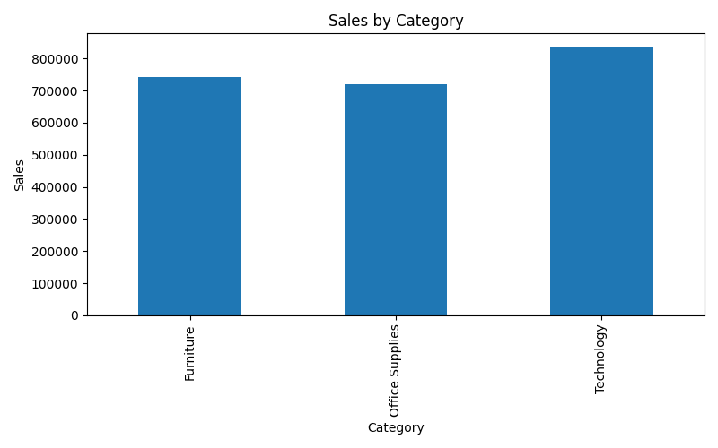
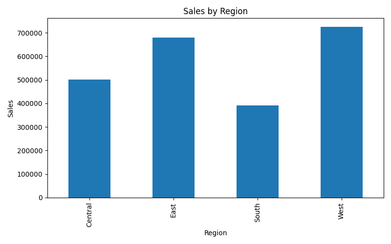
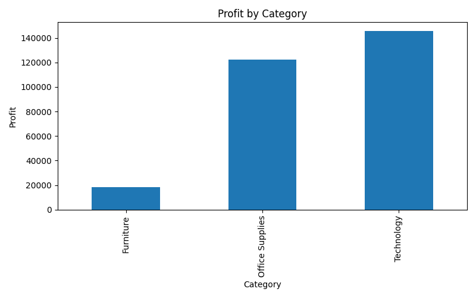
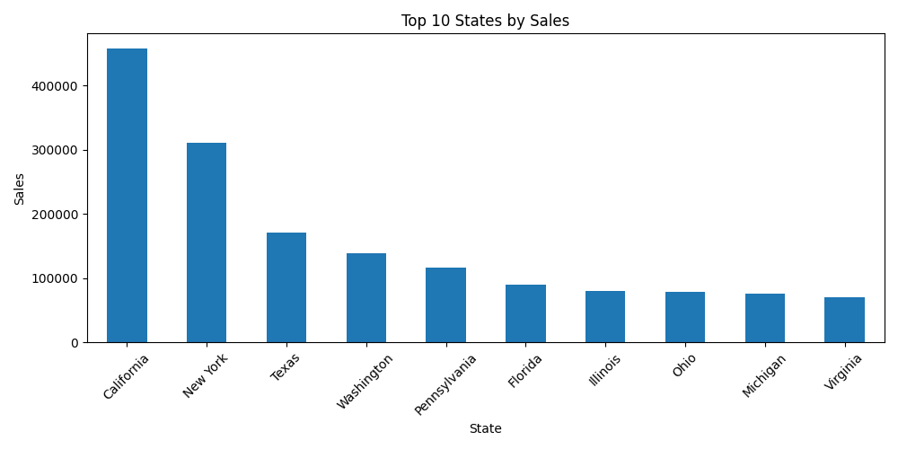
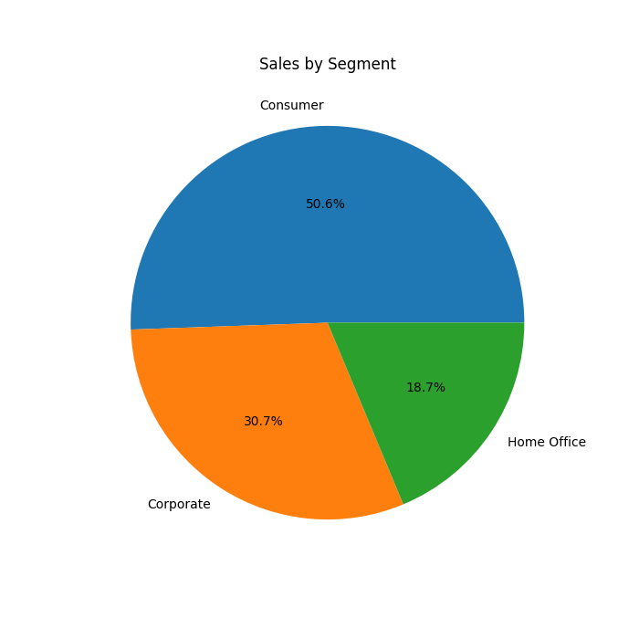
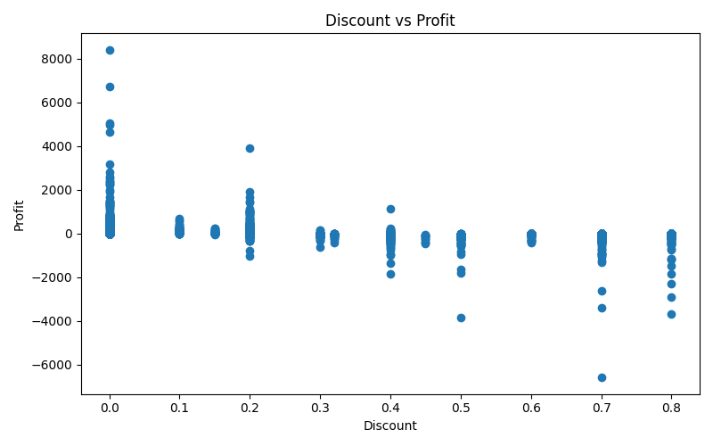

# 📊 Sales Data Analysis


---

## 📌 Project Overview

This project performs Exploratory Data Analysis (EDA) on retail sales data using Python. The objective is to analyze sales performance, profitability, customer segments, and regional trends.

---

## 🛠️ Technologies Used

- Python
- Pandas
- NumPy
- Matplotlib

---

## 📂 Dataset

- Sample Superstore Dataset
- Total Records: **9994**
- Features: Sales, Profit, Region, Category, Segment, Discount

---

## 📈 Key Performance Indicators

| Metric | Value |
|-------|--------|
| Total Sales | $2,297,200 |
| Total Profit | $286,397 |
| Average Sales | $229.86 |
| Total Orders | 9994 |

---

## 📊 Analysis Performed

✅ Sales Analysis

✅ Profit Analysis

✅ Category Analysis

✅ Region Analysis

✅ Segment Analysis

✅ Discount vs Profit Analysis

✅ Top States Analysis

---

## 🔍 Key Insights

- Technology generated the highest sales.
- West region contributed maximum revenue.
- California achieved the highest sales.
- Higher discounts reduced profits.
- Consumer segment generated maximum sales.

---

## 📷 Visualizations

### Sales by Category



---

### Sales by Region



---

### Profit by Category



---

### Top 10 States by Sales



---

### Sales by Segment



---

### Discount vs Profit



---

## 🚀 Project Structure

```text
SALES DATA ANALYSIS
│
├── charts
│   ├── category_sales.png
│   ├── discount_profit.png
│   ├── profit_category.png
│   ├── region_sales.png
│   ├── segment_sales.png
│   └── top_states.png
│
├── README.md
├── requirements.txt
├── sales_analysis.py
└── SampleSuperstore.csv
```

---

## ▶️ Run Project

```bash
pip install -r requirements.txt

python sales_analysis.py
```

---

## 👨‍💻 Author

**Anshika Tyagi**

BCA Student | Python | Data Analytics | Machine Learning